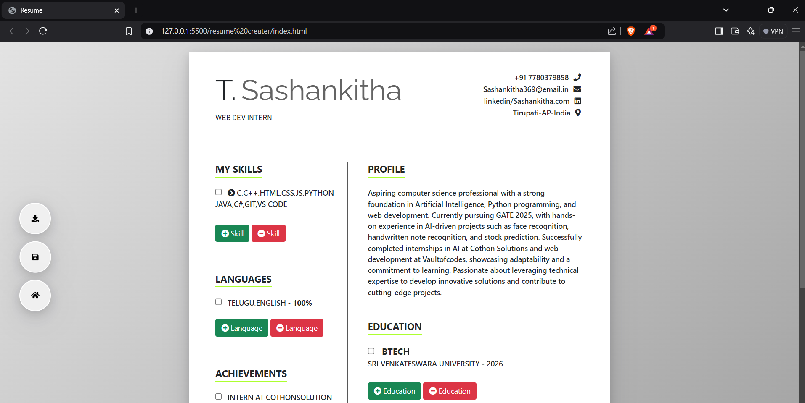
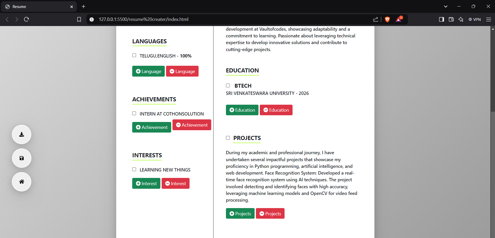

<h1>
  Resume-Creator
</h1>
<h3>
  Summary 
</h3>

  A resume creator developed with HTML, CSS, and JavaScript is a web-based application designed to streamline the resume-building process. It features a clean, interactive interface where users can input personal information, education, work experience, skills, and achievements. The application dynamically displays the entered details in a visually appealing resume format, allowing real-time previews and edits.

CSS ensures responsive and professional styling, with templates that cater to different industries and preferences. JavaScript adds interactivity, enabling users to customize sections, rearrange elements, and validate data for completeness and accuracy. Some implementations may include functionality to export resumes as PDF files or shareable HTML links, making the tool versatile for both offline and online uses.

This resume creator eliminates the need for complex design software, offering a quick, user-friendly solution for job seekers to create standout resumes. Its modular design ensures scalability, allowing developers to integrate advanced features like theme selection, analytics, or AI-driven content suggestions for future enhancements.

<h4>
  The output show as follow:-
</h4>

